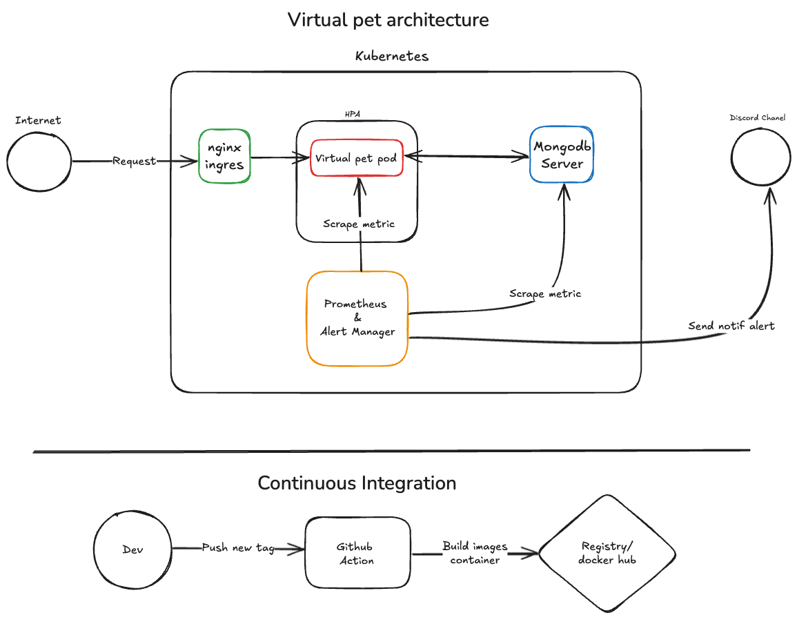
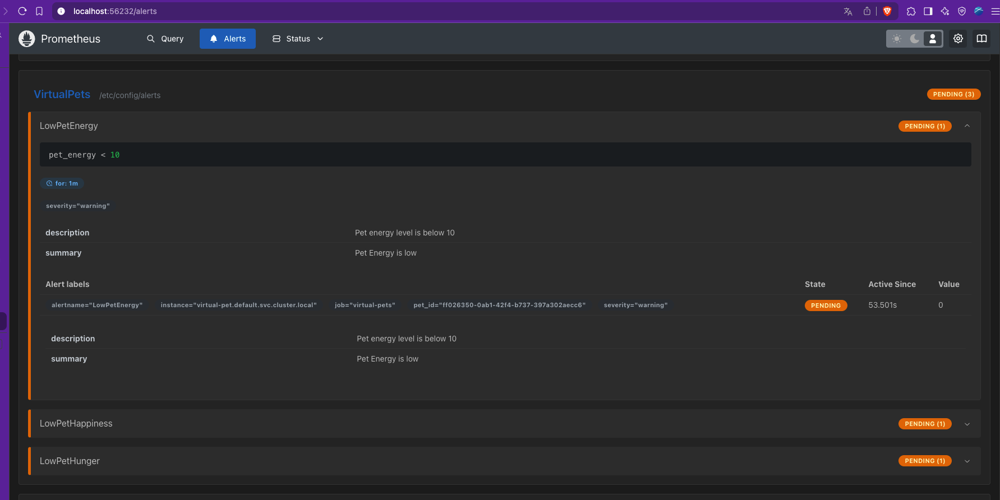
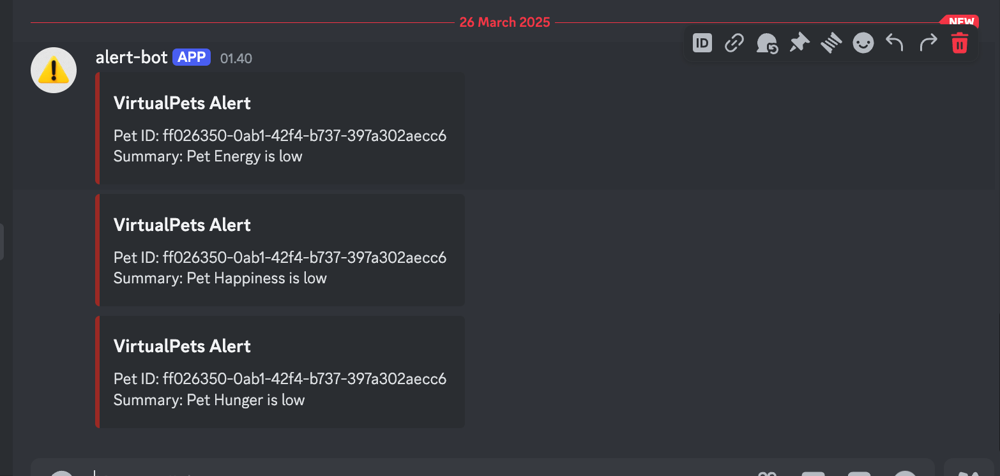

# Virtual Pet Documentation
## Project Architecture

<p align="justify">
In this architectural design, I have tried to simplify it as much as possible while maintaining durability, scalability, and high availability.

For durability, scalability, and high availability, I leverage the advantages of Kubernetes to address these challenges. One of the features I use is Horizontal Pod Autoscaler (HPA), along with node affinity and pod affinity, to ensure that pods are distributed across all nodes.

To maintain high availability, if a node fails, the service will remain available, ensuring no issues in handling incoming traffic. Additionally, the system can scale up or down the number of available pods based on traffic demand.
</p>

### Metric and Log
<p align="justify">
For application metrics and logs, I added metric data for happiness, hunger, and energy to be monitored, along with supporting data from the Golang code.

For logging, I print every requested endpoint to the container's stdout.
</p>

### Alert and Monitoring
<p align="justify">
For alerts, I added notifications for application metrics such as happiness, hunger, and energy. I believe this is important because it makes it easier to monitor the condition of the animals and quickly detect if any of them need care.

I also added alerts for Kubernetes services, including Disk pressure, Memory pressure, Node not ready, High CPU usage, High memory usage, Job failed, PVC pending, and more. This helps to quickly identify issues with Kubernetes pods and nodes.

For monitoring, I rely on Prometheus to scrape metrics and handle related tasks.
</p>

### Failure scenario 
For failure scenarios, I have implemented a few cases:
- Panic scenario: I added a `/panic` endpoint to the API with automatic recovery in the code to prevent the application from stopping if a panic occurs.
- Random pod deletion: This is used to demonstrate the application's high availability.
- Random node deletion: Similarly, this is used to test the application's high availability.

### Automation
<p align="justify">
For automation, I have only implemented CI with a trigger process. When a new release tag is created on GitHub, GitHub Actions will run to build the container image. Once the build is successful, the image will be pushed to the registry (Docker Hub).

For now, due to my cloud provider limitations and time constraints, I develop and test everything on my local laptop.
</p>

## Project Structure

```
.
├── .github/
│   └── workflows/               # GitHub Actions workflows
├── Img/                         # Images For Documentation
├── Infra/
│   ├── service-development/     # Local development setup 
│   └── service-production/      # Production setup (K8s)
├─── virtual-pet                 # Virtual pet code
│    ├── models/                 # Data models
│    ├── Dockerfile              # Application container
│    ├── main.go                 # Application code
│    └── postman_collection.json # Postman api collection virtual pet
└── README.md                    # Documentation 
```

## Alert Test



## Project Runbook
- [Development](Infra/service-development/README.md)
- [Production](Infra/service-production/README.md)

## improvements
For improvements:
- Implementing IaC to simplify the setup of the Kubernetes environment and its dependencies.
- Adding a CD process to the automation pipeline for a more agile deployment process.
- Enhancing or replacing monitoring and observability tools with solutions like Signoz, which offers more features such as APM, central logging, tracing, metrics scraping, alert management, and more.